# 🏥 Daisuke Clinic System Workflow

This documentation outlines the main steps involved in using the **Daisuke Clinic** management system. Each step is accompanied by a description and a placeholder for inserting screenshots.

---

## 1. 📋 Main Menu Display

Users are presented with a main menu consisting of options for Admin, Doctor, and Patient.

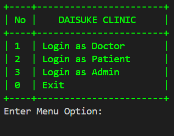

---

## 2. 👨‍⚕️ Doctor Login Stage

Doctors can log in by entering their ID. The system will record the login time and display the doctor's information.

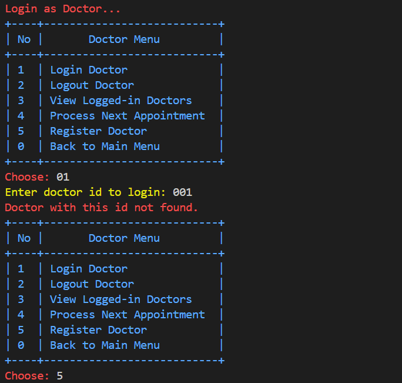
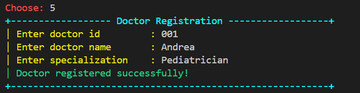
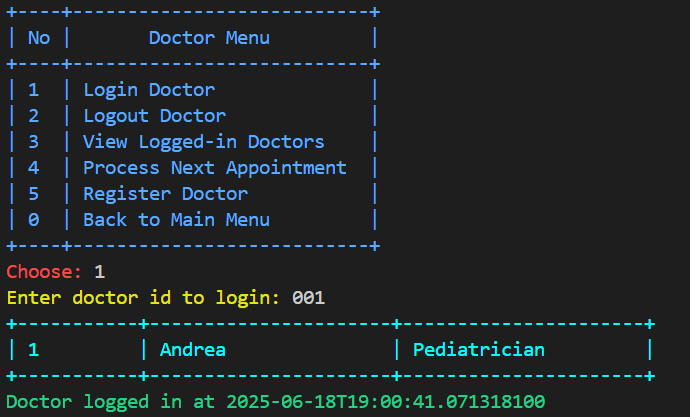
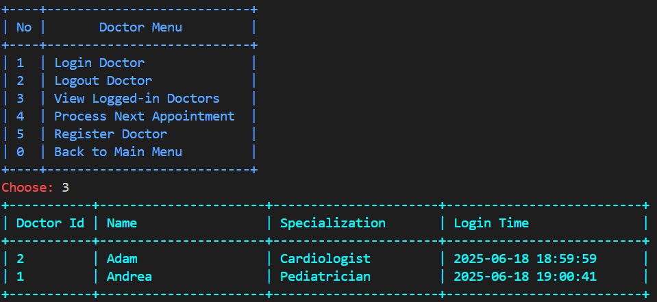

---
## 3. 👥 Patient Registration

New patients can register by providing their ID, name, age, address, and phone number. After completing the registration, they can proceed to make an appointment and view the upcoming appointments.

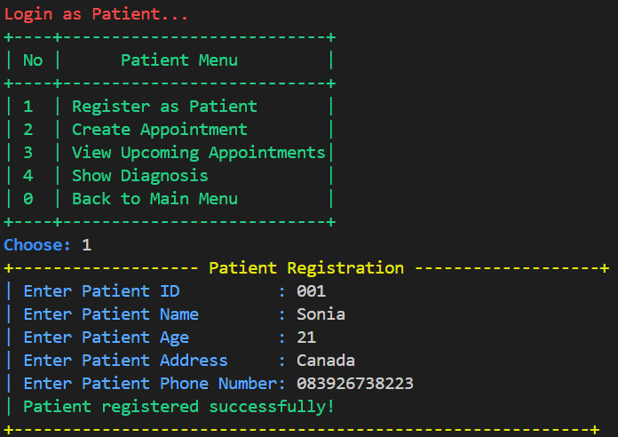
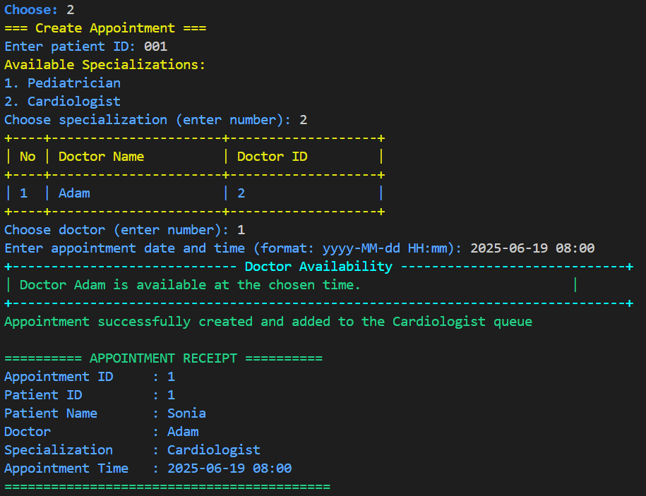
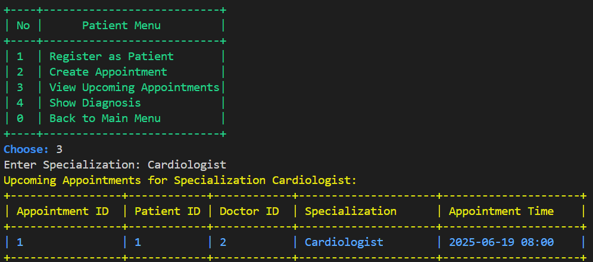

---

## 4. 🩺 Doctor Menu - Diagnosing Patients

After selecting an appointment, doctors can fill in the diagnosis, treatment plan, and prescriptions.

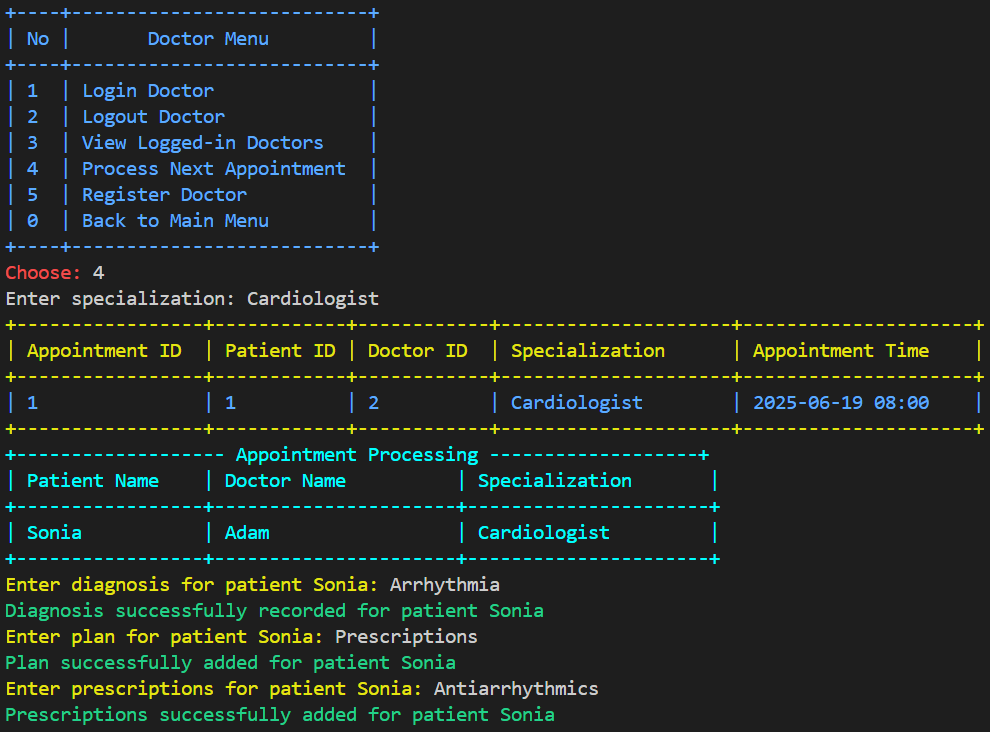
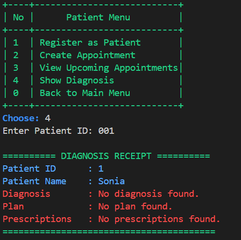
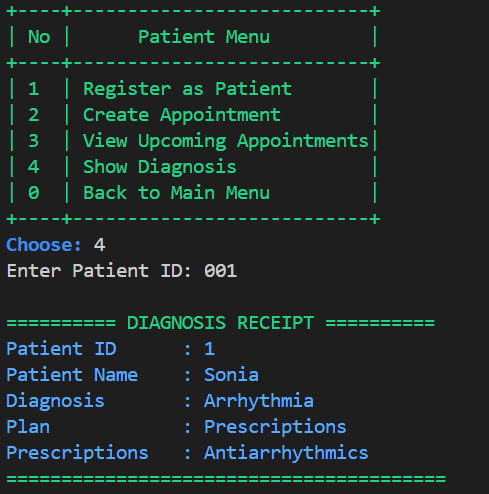

---

## 5. 👨‍⚕️ Doctor Logout Stage

Doctors can log out of the system after completing their tasks. The system will record and update the doctor's status.

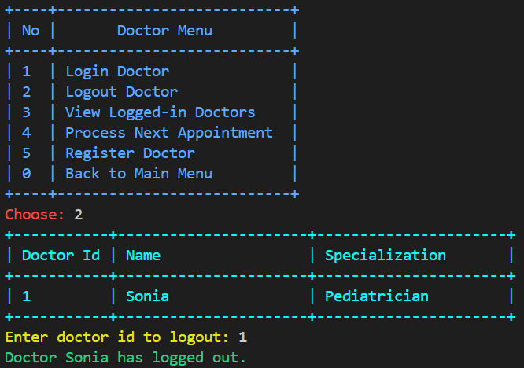

---

## 6. 🧑‍💼 Admin Menu

Admins can access features to add/remove doctors and patients, as well as view/search doctor and patient data.

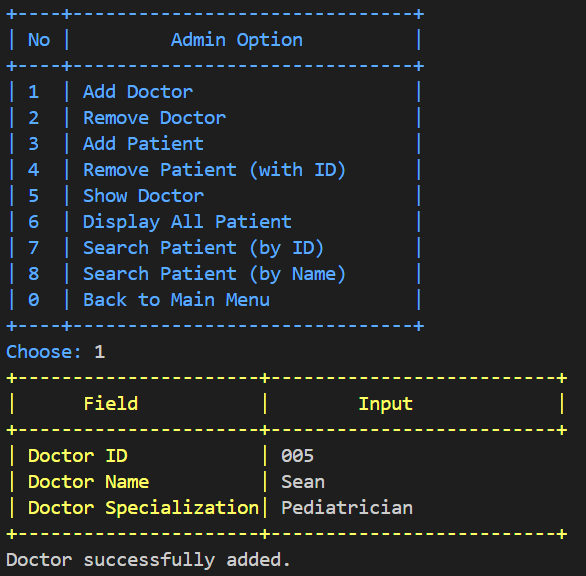
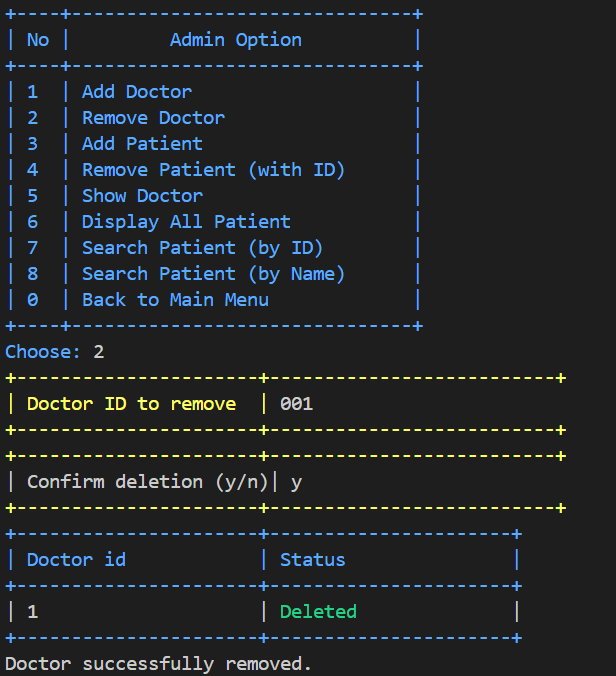
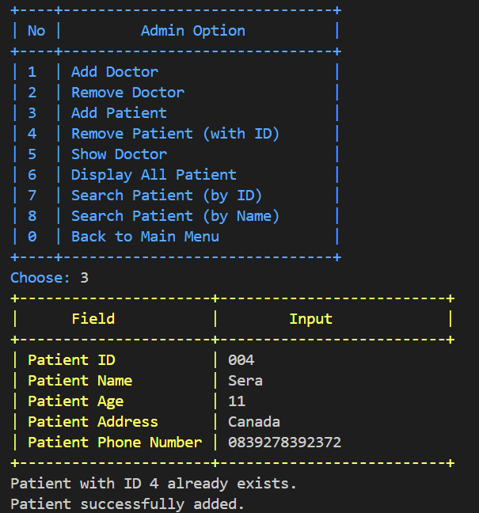
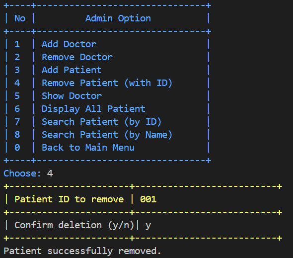

---

## 7. 📝 Show Doctors and Patients
Admins can view comprehensive details for each doctor, including ID, name, specialization, and current status. Patient information such as ID, name, age, address, and contact details is also accessible for review and management.

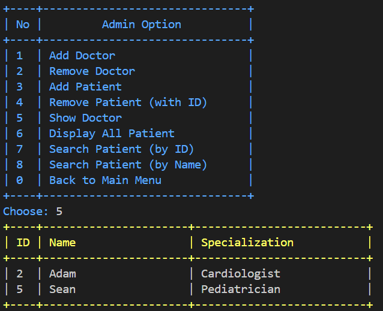
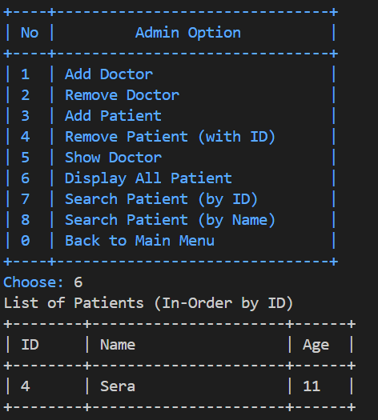

---

## 8. 🔍 Searching for a Patient

Admins can search for patients by ID or name for quick access to patient records.

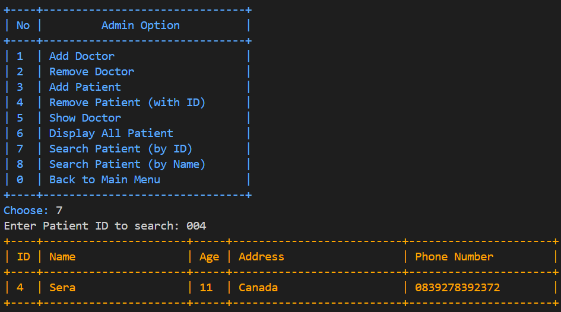
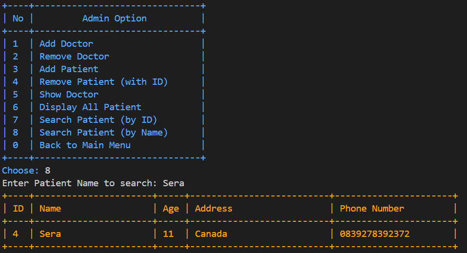

---

## 9. 🔚 Logout

After completing their activities, users can log out from the system.

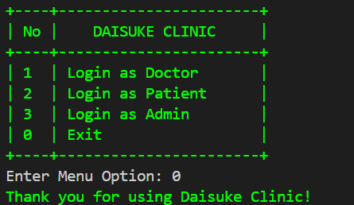

---
